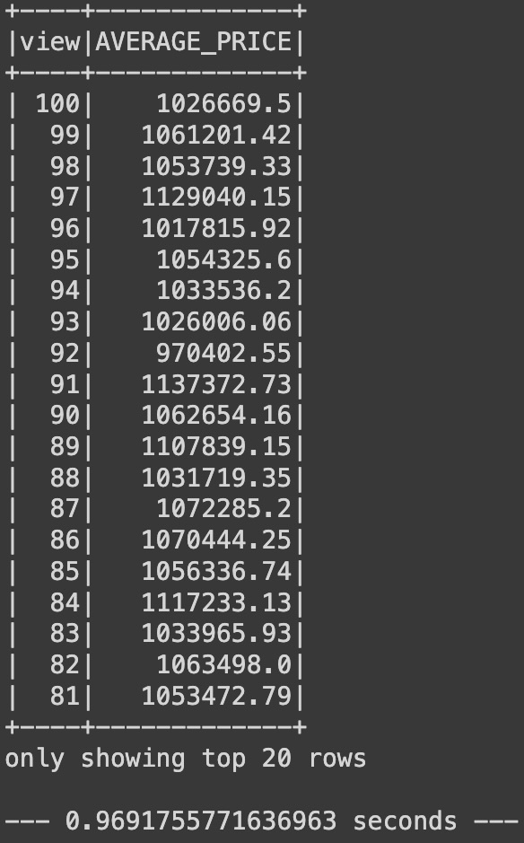

# Home_Sales

#### Used PySpark and PySQL to determine key metrics about home sales data through completing the following steps:

- Read the home_sales_revised.csv data thats in a AWS S3 bucket into a Spark DataFrame.
- Create a temporary table called home_sales.
- Find the average price for a four-bedroom house sold for each year. 

  

- Find the average price of a home for each year it was built that has three bedrooms and three bathrooms.

  

- Find the average price of a home for each year that has three bedrooms, three bathrooms, two floors, and is greater than or equal to 2,000 square feet.

  

- Find the "view" rating for homes costing more than or equal to $350,000, and determine the run time for this query.

  

- Cache my temporary table home_sales.
- Check if my temporary table is cached.
- Use the cached data, run the query that filters out the view ratings with an average price of greater than or equal to $350,000 and determine the runtime and compare it to uncached runtime.

  

- Partition by the "date_built" field on the formatted parquet home sales data.
- Create a temporary table for the parquet data.
- Run the query that filters out the view ratings with an average price of greater than or equal to $350,000 and determine the runtime and compare it to uncached runtime.
- Uncache the home_sales temporary table.
- Verify that the home_sales temporary table is uncached using PySpark.

